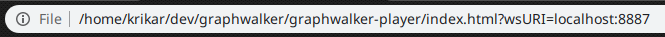

# graphwalker-player

The GraphWalker player, will visualize your tests progress on a single web page.


## What you need to do in your test

You need to add the GraphWalker Websocket Server to your test. There is an example in [PetClinc](https://github.com/GraphWalker/graphwalker-example/blob/master/java-petclinic/src/main/java/com/company/runners/WebSocketApplication.java)

But in short, add the GraphWalker Websocket to your Maven project:

```xml
<dependency>
   <groupId>org.graphwalker</groupId>
   <artifactId>graphwalker-websocket</artifactId>
   <version>4.1.0</version>
</dependency>
```

Create the Websocket server and start it. See code below:

```java
public static void main(String[] args) throws IOException, InterruptedException {
    Executor executor = new TestExecutor(PetClinic.class,
            FindOwners.class,
            NewOwner.class,
            OwnerInformation.class,
            Veterinariens.class);

    WebSocketServer server = new WebSocketServer(8887, executor.getMachine());
    server.start();

    Result result = executor.execute(true);
    if (result.hasErrors()) {
        for (String error : result.getErrors()) {
            System.out.println(error);
        }
    }
    System.out.println("Done: [" + result.getResults().toString(2) + "]");
}
```

The Websocket Sever will be started using the port `8887` in the example above.

## The Player

* Download the [index.html](index.html) file to your computer.
* Add to the url where your test runs, and the port used by your tests Websocket server: <br>
  * `wsURI=localhost:8887`<br>
 If your test runs on the same machine as your player, use `localhost`, otherwise, use the IP address to the machine where your tests is running.<br>
 Complete URL could look like :<br>
  * `file://<YOUR DOWNLOAD PATH ON YOUR COMPUTER>index.html?wsURI=<IP ADDRESS OF MACHINE RUNNING THE TEST>:<PORT USED BY WEBSOCKET SERVER IN YOUR TEST>`
* Use that complete url in a web browser<br>
  
* The player will automatically connect to your test when the test starts.

## The visualization

* Vertices and edges in light blue colors, are not yet visited (or executed by the test).
* When a vertex or edge is visited, it vill be colored light gray..
* An edge or vertex currently being executed by the test  will be highlighted with a black border.
* When many models are used, the will be placed next to each other by the Player. In ranomd order, and using a grid layout for the individual model.
